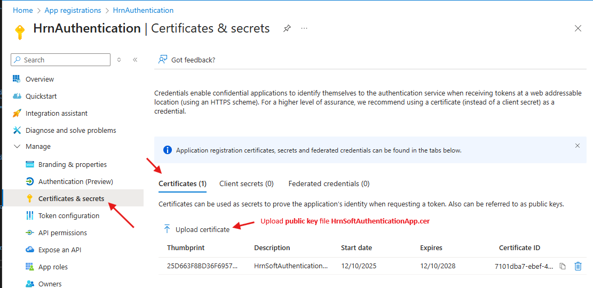

In many project scenarios, especially in secure environments, client certificates are used to authenticate clients to servers. 
This README provides an overview of how to implement and use client certificates in your application.
## What is a Client Certificate?
A client certificate is a digital certificate that is used to identify and authenticate a client to a server. It is typically issued by a trusted Certificate Authority (CA) and contains information about the client, such as its public key, identity, and the CA's digital signature.
## Why Use Client Certificates?
Client certificates provide an additional layer of security by ensuring that only authorized clients can access certain resources or services. They help to:
- Authenticate clients to servers
- Encrypt communication between clients and servers
- Prevent unauthorized access
- Enhance trust in client-server interactions
- ## How to Implement Client Certificates

- **Generate a Client Certificate**

	Use tools like Powershell, OpenSSL or your organization's CA to generate a client certificate.

	1. Create a self-signed certificate
	
	```powershell
	$cert = New-SelfSignedCertificate `
		-Subject "CN=HrnSoftAuthenticationAppCert" `
		-CertStoreLocation "Cert:\CurrentUser\My" `
		-KeySpec Signature `
		-KeyLength 2048 `
		-NotAfter (Get-Date).AddYears(3)
	```
	2. Export PFX (private key)
	
	```powershell
	Export-PfxCertificate `
		-Cert "Cert:\CurrentUser\My\$($cert.Thumbprint)" `
		-FilePath ".\HrnSoftAuthenticationApp.pfx" `
		-Password (ConvertTo-SecureString "Pass@123" -AsPlainText -Force)
	```
	3. Export CER (public key)
	
	```powershell
	Export-Certificate `
		-Cert "Cert:\CurrentUser\My\$($cert.Thumbprint)" `
		-FilePath ".\HrnSoftAuthenticationApp.cer"
	```
	4. Display the certificate thumbprint
	
	```powershell
	(Get-PfxCertificate -FilePath .\HrnSoftAuthenticationApp.pfx).Thumbprint
	```
	5. Convert private key PFX to Base64 string
	
	```powershell
	$pfxBytes = [System.IO.File]::ReadAllBytes(".\HrnSoftAuthenticationApp.pfx")
	[Convert]::ToBase64String($pfxBytes) | Out-File ".\HrnSoftAuthenticationAppBase64.txt"
	```

- **Upload the Certificate to Azure AD**
		
	

- **Authenticate to Microsoft Graph using the Certificate**

Install the required packages below in .NET8 web app
```nuget
Install-Package Azure.Identity
Install-Package Microsoft.Graph
```

C# code to create graph service using client certificate authentication (certificate from .pfx file):

```csharp
var cert = new X509Certificate2(_entraSettings.CertificatePath, _entraSettings.CertificatePassword, X509KeyStorageFlags.MachineKeySet | X509KeyStorageFlags.EphemeralKeySet | X509KeyStorageFlags.Exportable);           
var credential = new ClientCertificateCredential(_entraSettings.TenantId, _entraSettings.ClientId, cert);
var graphClient = new GraphServiceClient(credential);
```
C# code to create graph service client using client certificate (certificate as base64 string) 
```csharp
byte[] certBytes = Convert.FromBase64String(_entraSettings.CertificateBase64 ?? throw new ArgumentNullException("CertificateBase64 is null"));
var cert = new X509Certificate2(certBytes, _entraSettings.CertificatePassword, X509KeyStorageFlags.MachineKeySet | X509KeyStorageFlags.EphemeralKeySet | X509KeyStorageFlags.Exportable);
var credential = new ClientCertificateCredential(_entraSettings.TenantId, _entraSettings.ClientId, cert);
var graphClient = new GraphServiceClient(credential);
```
C# code to create aph service client using certificate from certificate store by thumbprint
```csharp
X509Certificate2? cert = null;
using (var store = new X509Store(StoreName.My, StoreLocation.CurrentUser))
{
    store.Open(OpenFlags.ReadOnly);
    cert = store.Certificates.Find(X509FindType.FindByThumbprint, _entraSettings.CertificateThumbPrint, false)
        .OfType<X509Certificate2>().FirstOrDefault();
}
var credential = new ClientCertificateCredential(_entraSettings.TenantId, _entraSettings.ClientId, cert);
var graphClient = new GraphServiceClient(credential);
```